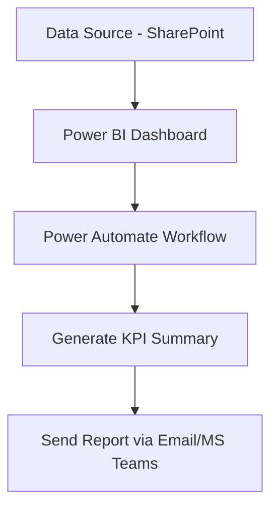

# Executive KPI Auto-Briefing System

### Automated KPI Reporting and Executive Briefing Platform

**Automating KPI monitoring and executive reporting to enable faster data-driven decision-making.**

---

# Overview

The **Executive KPI Auto-Briefing System** is an automated reporting pipeline that collects KPI metrics, generates performance dashboards, and distributes executive summaries to stakeholders on a scheduled basis.

Many organizations rely on **manual compilation of weekly KPI reports**, which is time-consuming and prone to inconsistencies. This project demonstrates how automation tools can streamline reporting workflows and ensure stakeholders receive timely insights.

The system integrates **Power BI dashboards with automated workflows** to produce and distribute KPI briefings every week.

---

# Objectives

- Automate the generation and distribution of KPI reports  
- Provide executives with quick summaries of key performance metrics  
- Reduce manual reporting workload  
- Highlight potential performance risks through alert indicators  
- Enable faster data-driven decision making  

---

# Key Features

## KPI Dashboard

- Real-time KPI visualization using **Power BI**
- Interactive filtering and trend monitoring
- Consolidated view of operational metrics

## Automated Reporting

- Scheduled workflow triggered every **Monday at 8 AM**
- Automatic dataset refresh and dashboard update
- Automated summary report generation

## Alert Indicators

- Red-flag thresholds for critical KPIs
- Color-coded alerts for quick executive visibility
- At-a-glance identification of performance deviations

## Automated Distribution

- Report delivery via **Microsoft Teams**
- Scheduled notifications to stakeholders
- Eliminates manual report sending

---

# System Architecture

